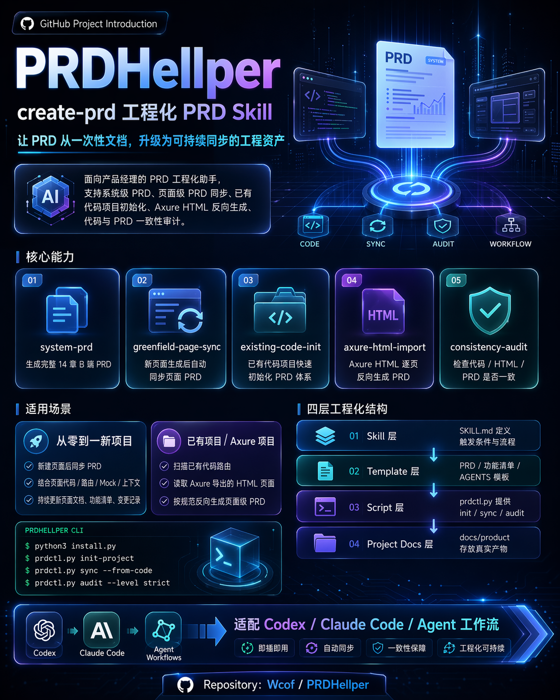

# PRDHellper · create-prd



> 安装后可被主流 AI 编程工具自动发现的 PRD 工程化 Skill：能生成、同步、审计页面级与系统级 PRD，并把结果稳定落到目标项目根目录 `docs/prd/`。

## 装上就能用

统一入口：

```bash
python3 install.py
```

无交互快速安装：

```bash
python3 install.py --yes
```

保留问答式安装：

```bash
python3 install.py --wizard
```

安装完成后，工具会在目标项目根目录维护以下发现入口：

- `AGENTS.md`
- `CLAUDE.md`
- `.agents/AGENTS.md`
- `.claude/CLAUDE.md`

并引导 Agent 使用：

```text
.agents/skills/create-prd/SKILL.md
```

## 安装后会发生什么

当安装到业务项目时，默认行为如下：

1. Skill 安装到目标项目根目录 `.agents/skills/create-prd/`。
2. PRD 产物固定写入目标项目根目录 `docs/prd/`。
3. `existing-code` 模式会自动进行一次 `scan-code --create-prd`，生成路由清单、功能清单、页面 PRD 草稿与 changelog。
4. `greenfield` / `axure` 模式会先创建 `docs/prd/` 目录骨架，保证用户立刻看见产物目录。

标准产物目录：

```text
docs/prd/
├── 00-项目上下文.md
├── 01-页面路由清单.md
├── 02-功能清单.md
├── 03-全局交互规则.md
├── 04-PRD编写规范.md
├── system/
├── pages/
├── changelog/
├── audit/
├── imports/
├── templates/
└── .index/traceability.json
```

## 能做什么

| 能力 | 输入 | 输出 |
|---|---|---|
| 已有代码初始化 PRD | 路由与页面代码 | 路由清单、功能清单、页面 PRD |
| 页面变更同步 | git 变更/页面代码 | 页面 PRD、changelog、清单增量更新 |
| Axure HTML 反向导入 | Axure 导出目录 | 页面识别清单、页面 PRD、导入报告 |
| 系统级 PRD 生成 | 产品范围与约束 | 系统级 PRD + 页面拆分要求 |
| 一致性与文案审计 | 代码 + PRD 文档 | 审计报告（结构 + 文案建议） |

## Demo / Showcase

本仓维护产品化样例索引：

- [showcases/INDEX.md](showcases/INDEX.md)
- `showcases/sample-output/`：安装后产物结构与样例内容
- `test-prompts.json`：覆盖核心场景的验收用 prompts

## 核心机制

### 1. 轻入口路由

`SKILL.md` 只做模式路由和最小必读集，不在入口预加载无关章节。

### 2. 按需加载与逐步释放

- 先选主模式。
- 先产出最小可用结果。
- 再按当前任务读取下一层材料。

### 3. 合格交付标准

以下 3 条必须同时满足：

1. 页面级 PRD 在 `docs/prd/pages/`。
2. 系统级 PRD 在 `docs/prd/system/`。
3. 单个总 PRD 只能是汇总草稿，不能替代 `system/` 与 `pages/` 拆分产物。

### 4. 一致性门禁

统一入口：

```bash
bash .agents/skills/create-prd/scripts/check_consistency.sh . --mode=strict
```

该入口会执行同步与审计，并输出结构问题与文案规范建议。

## 仓库与目标项目的目录区别

请区分两个目录口径：

1. PRDHellper 仓库自身文档：当前仓库按 `AGENTS.md` 使用 `docs/produc/`。
2. 被安装的业务项目产物：固定写入目标项目根目录 `docs/prd/`。

## 验证与故障排查

基础测试：

```bash
python3 -m pytest -q
```

发布验收：

```bash
python3 scripts/verify_release.py
```

构建后验收：

```bash
python3 scripts/build.py
python3 scripts/verify_release.py
```

常见问题：

1. PRD 被写进 PRDHellper 目录：应改为目标项目根目录 `docs/prd/`。
2. 只生成一个总 PRD：需要拆分到 `docs/prd/system/` 与 `docs/prd/pages/`。
3. 无 Python 环境：用 `install.command`/`install.bat` 兜底安装并依赖发现文件注入。
4. Agent 没命中 Skill：检查根目录 `AGENTS.md` / `CLAUDE.md` 的 `create-prd` 注入块是否存在。

## 主模板策略

主模板优先源：

```text
main-template/create-prd-skill-main
```

工程化扩展入口：

```text
references/templates/extensions/
```

策略配置：

```text
configs/template-policy.yaml
```
